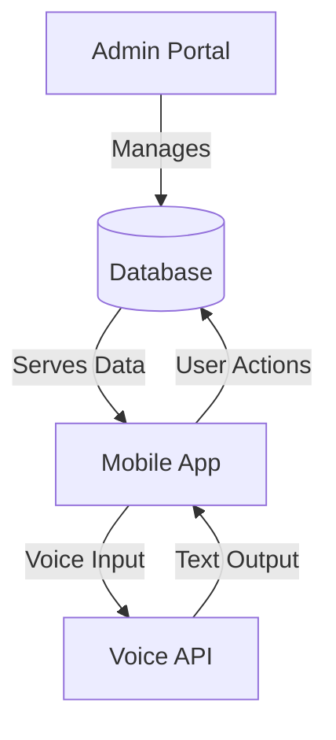

# Library Management System

  

## Project Overview

Our innovative library management system revolutionizes traditional library operations through cutting-edge technology and user-centric design. The platform offers:

- **For Librarians**: Powerful tools for resource management and user interaction
- **For Patrons**: Intuitive access to library resources and services
- **Key Innovation**: Voice-to-text integration for enhanced accessibility

## Core Features

### Librarian Functions
- Complete book/e-book management (add/update/remove)
- Advanced search with real-time availability tracking
- Streamlined order verification system
- Automated notifications (due dates, events)
- Real-time chat support for users

### User Functions
- Unified interface for physical books and e-books
- Easy search and order placement
- Borrowing history management
- Direct communication with librarians
- Voice-to-text interaction
- Event notifications and announcements

## Technical Implementation

### System Architecture
- **Frontend**: HTML5, CSS3, Bootstrap 5
- **Backend**: 
  - Python (Django framework) for web admin
  - Java for mobile application
- **Database**: MySQL
- **Special Integration**: Voice-to-text API

### Development Environment
- **Operating System**: Windows 8+
- **IDEs**: 
  - PyCharm Community (web admin)
  - Android Studio (mobile app)
- **Browser Support**: Chrome, Edge, Internet Explorer

## Getting Started

### How to Run the Project
```bash
# Clone repository
git clone https://github.com/SH4N1D/Library_Mgt.git

# Set up virtual environment
cd Library_Mgt/
python -m venv venv
venv\Scripts\activate  # On Windows

# Install dependencies
pip install -r requirements.txt

# Initialize database
python manage.py migrate

# Run development server
python manage.py runserver
```

### Mobile App Setup
1. Open Android Studio
2. Import project from `/Library_Mgt/Android_Studio`
3. Sync Gradle dependencies
4. Build and run on emulator or device

## System Workflow



## Why Our System Stands Out

- **Dual Interface**: Web-based administration + mobile user access
- **Voice Integration**: Natural language processing for accessibility
- **Real-time Communication**: Built-in chat system
- **Comprehensive Management**: Handles both physical and digital resources

## License

MIT License - Copyright (c) 2023 Shanid

---
